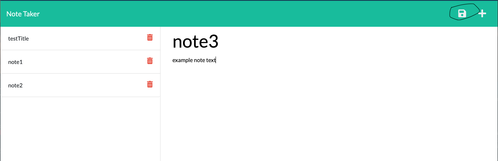

# Note Taker

## Description

It's a note taking app that lets the user store their notes. Each note has a title and a text section, both of which are stored into a local database when the user clicks the save button. After a note is saved, itself and all the notes that the user has saved into the database is retrieved and rendered on the browser window.

## Installation

To run the application:

- Run the command `npm init -y` to set up a new npm package
- Run the command `npm i` to install the prerequisites
- Run the command `node server.js`to start the server
- Open up a browser window and enter "http://localhost:3001" to get to the front page.
- Click on the "Get Started" button to start taking notes

## Usage

Click inside the section "Note Title" in the browser window to enter a title for a new note.

Click inside the section "Note Text" to enter the content of a new note.

After entering the body of the new note, a save icon will appear on the top right corner of the brower, click on it to save the new note in the database.

Click on a note in the left panel to display the content of the note and its title.

At this point if the user wants to create a new note, they can click on the plus button at the top right to do so.

## Credits

hugh18019  
GitHub Profile: https://github.com/hugh18019

## Links

Walkthrough demo:
https://drive.google.com/file/d/1-x3uYtUFz48CRiVKLE2zACQcyWRpawzs/view?usp=sharing

## License

Licensed under the [MIT License](LICENSE).
